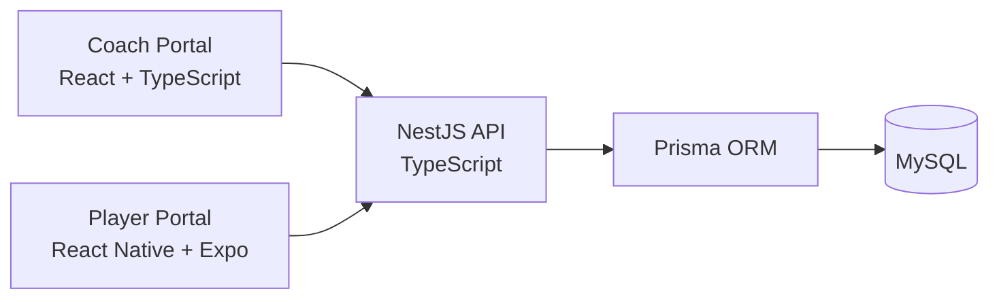

# Sports Performance Platform — Engineering Case Study

**Connected Performance Intelligence**

Sports Performance Platform (SPP) is a full-stack software platform for coaches, athletes and performance organizations.

The production source repository is private. This public repository documents selected engineering decisions, architecture and product-development work without exposing proprietary source code or sensitive implementation details.

---

## What I Built

I am building SPP across three primary application surfaces:

- **Coach Portal** — React + TypeScript web application for desktop and tablet
- **Player Portal** — React Native + Expo mobile application
- **API** — NestJS + TypeScript backend
- **Data Layer** — Prisma ORM with MySQL

My work spans frontend development, mobile development, backend APIs, data modelling, permissions, multi-tenant architecture, authentication boundaries and application workflows.

---

## Technology Stack

| Area | Technologies |
| --- | --- |
| **Web** | React, TypeScript, Vite |
| **Mobile** | React Native, Expo, TypeScript |
| **Backend** | Node.js, NestJS, REST APIs |
| **Data** | MySQL, Prisma ORM |
| **Development** | Git, GitHub, Docker, Postman, VS Code |

---

## High-Level Architecture

The Coach Portal and Player Portal share the same backend and domain model while presenting different workflows based on role, context and device.

---

## Selected Engineering Problems

### 1. Multi-Tenant Data Boundaries

SPP supports organizations containing teams, coaches and athletes.

A core engineering requirement is ensuring users only access data belonging to the correct organization and role context.

This affects:

- API authorization
- data queries
- team and athlete access
- administrative capabilities
- coach and athlete workflows

The goal is to keep tenant boundaries explicit rather than relying on frontend filtering alone.

### 2. Role-Based Permissions

Coach and athlete experiences require different capabilities.

Examples include:

- coaches managing athletes, teams and training
- athletes viewing and completing assigned work
- organization-level staff accessing broader administrative functions
- team-scoped staff operating only within their assigned teams

Authorization is enforced at the backend rather than treated only as a user-interface concern.

### 3. Data Modelling for Training History

Training software must distinguish between what was prescribed and what actually happened.

SPP separates workout prescriptions from performed results so historical athlete data remains accurate even if a coach later modifies future programming.

For example:

- prescribed exercise data is stored separately from performed results
- completed session results remain historical records
- future programming changes do not rewrite athlete history

This distinction became an important domain-modelling decision.

### 4. Shared Domain, Different Experiences

SPP has two primary interfaces built around the same backend and domain model.

**Coach Portal**

- desktop and tablet
- team oversight
- athlete management
- planning and review
- coordination

**Player Portal**

- mobile-first
- athlete readiness
- assigned training
- development objectives
- session execution
- progress

The underlying concepts are shared, but the interaction models are intentionally different.

### 5. Authentication and Application Security

Authentication and authorization are treated as backend concerns rather than relying on client-side trust.

Protected routes and role-aware access controls prevent users from reaching data or operations outside their permitted context.

Development and production authentication concerns are also kept separate so local-development tooling does not become part of the production security model.

### 6. Development and Test Data Separation

SPP uses separate development and test database environments.

Automated test workflows are designed to fail safely rather than risk destructive operations against the normal development database.

This includes:

- dedicated test database configuration
- environment validation
- isolated test data
- controlled seed behaviour

---

## Engineering Approach

Some principles I try to follow while building SPP:

- Keep domain concepts explicit
- Separate presentation from application logic
- Treat permissions as backend responsibilities
- Preserve historical data rather than rewriting it
- Prefer explainable system behaviour
- Design web and mobile experiences for their actual usage context
- Keep development and test environments safely separated
- Build reusable components where reuse improves clarity
- Avoid abstraction before the underlying problem is understood

---

## Selected Product Areas

The broader platform includes work across:

- athlete and team management
- training programming
- workout delivery
- athlete development objectives
- readiness and availability
- testing and personal bests
- coach-athlete communication
- performance review
- organizational workflows

This case study focuses on the engineering behind those experiences rather than documenting the complete product roadmap.

---

## What I Have Learned

Building SPP has pushed me beyond implementing individual screens or isolated features.

It has required me to think about:

- how domain models affect future product behaviour
- how permissions propagate through an application
- how web and mobile experiences differ
- how backend decisions surface in UX
- how historical data should be preserved
- how to structure increasingly complex application code
- how to debug problems spanning multiple layers
- how technical decisions create downstream trade-offs

One of the parts of software development I enjoy most is taking an ambiguous problem, breaking it into smaller pieces, questioning assumptions and working toward an implementation that solves the underlying problem rather than only the immediate symptom.

---

## Repository Scope

The primary Sports Performance Platform repository remains private because it contains proprietary application source code, internal product documentation and commercially sensitive implementation details.

This repository gives employers, collaborators and other developers visibility into the engineering work without exposing the private product itself.

Selected sanitized code examples may be added where appropriate.

---

## About Me

**Sean Plumridge**  
Software Developer · Full-Stack Product Builder  
Final-year IT Programming student at Nova Scotia Community College

- **Portfolio:** [seanplumridge.com](https://seanplumridge.com)
- **GitHub:** [SeanPlumridge](https://github.com/SeanPlumridge)
- **LinkedIn:** [seanplumridge](https://www.linkedin.com/in/seanplumridge)
